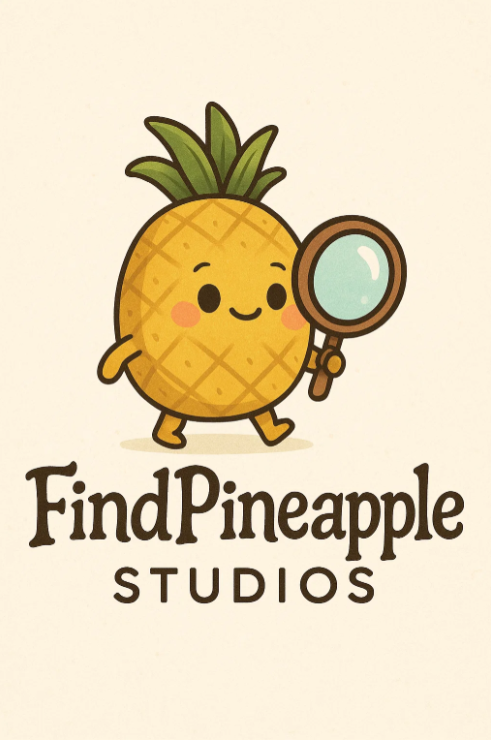

# Nameless – Prototype

  <!-- Add your logo here -->

**Version:** 1.2  
**Author:** Beth Hooper  
**Studio:** Find Pineapples Studios  
**Date:** October 6, 2025  

---

## Table of Contents
1. [Overview](#overview)  
2. [Core Concept](#core-concept)  
3. [Gameplay Mechanics](#gameplay-mechanics)  
   - [Combat](#combat)  
   - [Exploration](#exploration)  
4. [MVP / PoC Plan](#mvp--poc-plan)  
   - [Core MVP Goals](#core-mvp-goals)  
   - [Phase Summary](#phase-summary)  
   - [Phase Breakdown](#phase-breakdown)  
5. [Technical Design](#technical-design)  
6. [Art & Audio Direction](#art--audio-direction)  
7. [Post-MVP Roadmap](#post-mvp-roadmap)  
8. [Future Concepts](#future-concepts)  
9. [Appendices](#appendices)  

---

## Overview
**Nameless** is a turn-based strategy game set in the whimsical and mysterious Feywild. Players control an adventurer who has lost their name and must reclaim it by exploring magical nodes, solving environmental puzzles, and engaging in dice-and-card duels against cunning fey bosses.  

**Gameplay Focus:** Strategic card play, risk/reward mechanics, and rich painterly visuals.
**🟥 Add images or GIFs of concept art for the game  🟥**  
 <!-- Optional concept art -->

---

## Core Concept
Players navigate the Feywild, collecting cards, unlocking dice and UI themes, solving riddles, and dueling fey bosses to reclaim their lost name. Each node blends puzzles, exploration, and combat into self-contained experiences.

**Gameplay Loop:**  
1. Explore a node in the Feywild  
2. Encounter a fey boss  
3. Engage in turn-based dice + card combat  
4. Defeat boss → earn card rewards and riddle clues  
5. Progress to next node, collect new cards, uncover secrets  

---

## Gameplay Mechanics

### Combat
**Combat Phases:**  
- **Pre-Roll Card Phase:** Both sides play cards that affect upcoming dice outcomes  
- **Dice Roll Phase:** Dice roll simultaneously; physics and animations run independently  
- **Post-Roll Card Phase:** Reactive card play occurs after dice results  
- **Resolution Phase:** Dice totals compared; HP/points applied; flavor text displayed  

**Dice System:**  
- D6 dice represent attacks or skill checks  
- Card effects can modify dice rolls (rerolls, swaps, buffs)  

**Card System:**  
- Cards categorized by timing: pre-roll or post-roll  
- Modify dice outcomes, stats, or trigger effects  
- Customizable decks earned via exploration or boss fights  

**Enemy AI:**  
- Weighted rule-based AI reacts to player actions  
- Telegraphed attacks provide clarity and strategy  

**Player Interaction:**  
- Card selection for pre/post-roll phases  
- Dice rolls occur automatically after pre-roll selection  

**🟥 Add images or GIFs of combat flow charts  🟥**  
 <!-- Optional diagram -->

### Exploration
- Nodes are compact, visually distinct areas with puzzles, rewards, and clues  
- Example Node – Shimmering Glade: glowing flora, silver-barked trees, crystal ponds, floating motes  
- Puzzle types: logic, visual, environmental interaction  

**🟥 Add images or GIFs of node concept  🟥**  
 <!-- Optional node concept -->

---

## MVP / PoC Plan

### Core MVP Goals
- Player dice + card system  
- Enemy AI with weighted logic  
- One boss fight (Lurielle) with cheat mechanics  
- Exploration node with collectible cards and puzzles  
- Riddle/visual hint system for progression  
- Fully functional turn-based combat phases  

**Optional Additions:**  
- Basic animations for dice, cards, abilities  
- Light particle effects  

### Phase Summary
| Phase | Goal | Status |
|-------|------|--------|
| Phase 1 | Core Mechanics: Dice system, health tracking, match resolution | ✅ Completed |
| Phase 2 | Card System: Base card architecture, resource-based card data | 🔄 In Progress |
| Phase 3 | Turn Manager / Phase Flow | Planned |
| Phase 4 | First Boss Prototype (Lurielle) | Planned |
| Phase 5 | Exploration Node (Shimmering Glade) | Planned |
| Phase 6 | Player Integration | Planned |
| Phase 7 | Polish Pass | Planned |
| Phase 8 | MVP Playtest | Planned |

### Phase Breakdown
**Phase 1 – Core Mechanics:**  
- Dice with full physics and random orientation  
- Player/opponent health UI (3 lives)  
- Round resolution and match outcome messages  
- Reset functionality via dice roll  
- Placeholder assets for dice, player, opponent, table  

**Phase 2 – Card System (In Progress):**  
- Base card script + .tres resources  
- Deck creation for player/opponent  
- Hand dealing + hover animations  
- In progress: card placement, discard logic, integration of card effects  

**🟥 Add images or GIFs of current card system / UI here 🟥**  

**Phase 3–8:** See roadmap and development notes above.  

---

## Technical Design

**Architecture:**  
- Godot Engine (GDScript)  
- Modular nodes: CardManager, TurnManager, NodeManager  
- Signals + deferred calls for async UI/dice/logic  

**Card & Deck Data:**  
- MVP: .tres resource files for card info  
- Decks/hands stored in-memory  
- Post-MVP: JSON-based storage for cards, rewards, and player progress  

**Save & Reward System:**  
- Tracks decks, skins/themes, boss progress  
- JSON save planned post-MVP  

---

## Art & Audio Direction

**Visual Style:**  
- 3D painterly / watercolor textures  
- Magical glow for dice, cards, environment  
- Inspirations: Ori and the Blind Forest, Studio Ghibli, Trine  

**Characters:**  
- Adventurer: slender, simple garb, subtle magical accents  
- Lurielle: silver-skinned fey, flowing translucent hair, gossamer gown  

**Audio:**  
- Ambient Feywild sounds: wind, chimes, rustling leaves  
- Dice rolls: tactile clatter  
- Card effects: shimmer/chime cues  
- Boss telegraphs: melodic motifs  

---

## Post-MVP Roadmap

| Milestone | Focus | Timeline (Part-Time Dev) |
|-----------|-------|-------------------------|
| Vertical Slice (MVP) | 1 node + 1 boss | 3–4 months |
| Additional Nodes | 2–3 nodes with puzzles & bosses | +4–6 months |
| Thematic Unlocks | Card/dice/UI skins, unlockable sets | +2 months |
| Wager System | Fey Gamble mechanic | +2–3 months |
| Narrative & Polish | Dialogue, lore, polish | +3 months |
| Beta Build | Full progression, 4–5 nodes | ~12–14 months |
| Full Release | Marketing, QA, Steam release | ~16 months |

---

## Future Concepts
- Fey Gamble Mechanic: risk/reward betting affects card draw/dice outcomes  
- Customization & Unlocks: dice/card skins; complete sets unlock UI themes  
- Boss Mechanics: cheating abilities; steal cards/dice  
- Exploration Rewards: hidden puzzle secrets, rare card sets  

---

## Appendices
**🟥 Full Card List Here 🟥**  
**🟥 Boss Mechanics Table Here 🟥**  
**🟥 Puzzle Descriptions / Layouts Here 🟥**  
**🟥 Asset Inventory Here 🟥**  

---
